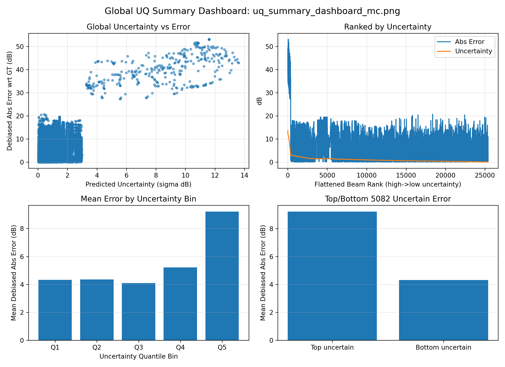
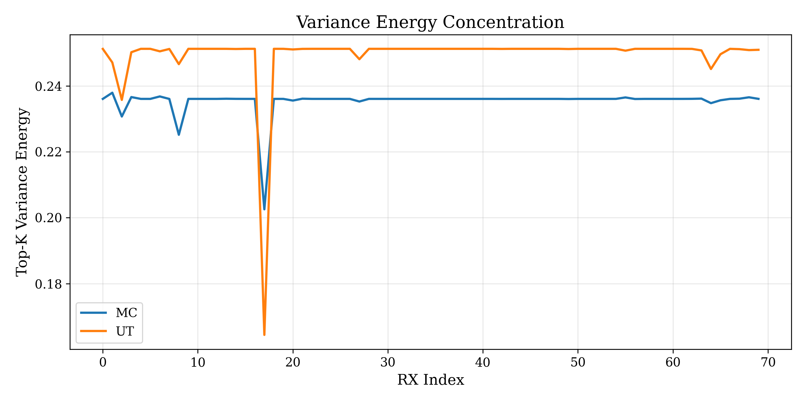

# Low-Rank Nonlinear Beamspace Uncertainty Propagation for RF Digital Twins

This repository implements scalable beamspace uncertainty propagation for RF Digital Twins. The pipeline uses RF-3DGS point clouds, low-rank stochastic perturbations, Unscented Transform (UT) propagation, Monte Carlo (MC) validation, and Sionna-based alignment for physics-consistent evaluation.

**Important prerequisite**: the `point_cloud.ply` file used by this pipeline is produced by the RF-3DGS project. Please read the RF-3DGS repository and paper before running these scripts.

- RF-3DGS code: https://github.com/SunLab-UGA/RF-3DGS
- RF-3DGS paper (arXiv): https://arxiv.org/abs/2411.19420
- IEEE TWC page (accepted version): https://ieeexplore.ieee.org/document/11355734

## What This Repo Provides

- Beamspace forward rendering from RF-3DGS PLY files.
- UT-based uncertainty propagation with MC diagnostics.
- Sionna alignment with per-RX agreement metrics.
- Reliability and risk-aware beam selection outputs.
- Figures and plots for reporting.

## Repository Structure

- `scripts/`: main pipeline entry points.
- `figures/`: generated results and plots for reports.
- `requirements.txt`: Python dependencies.
- `uq_config.example.json`: example configuration (copy to `uq_config.json`).
- `installation_usage.md`: full setup and execution instructions.

## Quick Start

1. Create a config file and set paths:

   ```bash
   cp uq_config.example.json uq_config.json
   # Edit uq_config.json to set forward.ply_path and sionna.scene_xml
   ```

2. Run the pipeline (from repo root):

   ```bash
   python scripts/run_rfdt_rendering.py --config uq_config.json --output-dir outputs
   python scripts/run_alignment_evaluation.py --config uq_config.json --rfdt outputs/rfdt_beam_energy_grid.npy --output outputs/sionna_beam_energy_grid_aligned.npy
   python scripts/run_ut_propagation.py --config uq_config.json --gt outputs/sionna_beam_energy_grid_aligned.npy --output-dir outputs
   python scripts/run_variance_validation.py --config uq_config.json --out-dir outputs/ut_mc_geometry_results
   python scripts/plot_rfdt_vs_sionna_comparison.py --config uq_config.json --rfdt outputs/rfdt_beam_energy_grid.npy --sionna outputs/sionna_beam_energy_grid_aligned.npy --save-dir outputs/plots
   ```

3. Optional smoke test:

   ```bash
   python scripts/run_smoke_tests.py --config uq_config.json --output-dir outputs --check-outputs
   ```

See `installation_usage.md` for the full environment setup and troubleshooting notes.

## Configuration Notes

- All hardcoded parameters have been moved to `uq_config.json` (or CLI overrides).
- Relative paths are resolved against the config file location.
- The Sionna alignment uses the *same* scene, frequency, array geometry, and angular grid as the RFDT forward pass, so consistency is enforced through the shared config.

## Outputs (Key Files)

- `rfdt_beam_energy_grid.npy`: RFDT beam energy in dB for all RX positions.
- `rfdt_beam_gradient_grid.npy`: RFDT energy gradients (per-RX, per-beam).
- `sionna_beam_energy_grid_aligned.npy`: Sionna-aligned beam energy grid.
- `rfdt_uq_mu_lin.npy`, `rfdt_uq_sigma_best_lin.npy`: UT mean and uncertainty (linear).
- `rfdt_selected_beams_topk.npy`: risk-aware beam selection.
- `uq_results.npz`: full UT and MC tensors for downstream analysis.

## Figures







## Tested Environment

The following environment was used for the latest runs in this workspace:

- Conda env: `rf-3dgs`
- Python: 3.10.19
- Sionna: 0.19.2 (RF-3DGS upstream notes 0.19.1 compatibility)
- TensorFlow: 2.15.1
- PyTorch: 2.10.0.dev20251212+cu130
- NumPy: 1.26.4

If you need maximum compatibility with RF-3DGS training, follow their README (Python 3.8 and CUDA 11.7/11.8).

## Citation

Please cite RF-3DGS if you use the PLY generation pipeline or any RF-3DGS outputs:

```bibtex
@article{rf3dgs2024,
  title={RF-3DGS: Wireless Channel Modeling with Radio Radiance Field and 3D Gaussian Splatting},
  author={Lihao Zhang and Haijian Sun and Samuel Berweger and Camillo Gentile and Rose Qingyang Hu},
  journal={arXiv preprint arXiv:2411.19420},
  year={2024}
}
```

For the accepted IEEE TWC version, see: https://ieeexplore.ieee.org/document/11355734

## License

MIT License (see `LICENSE`).
