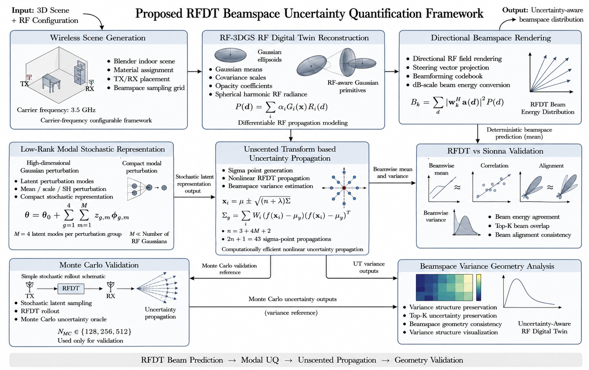
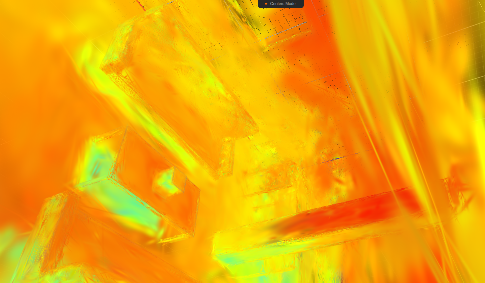
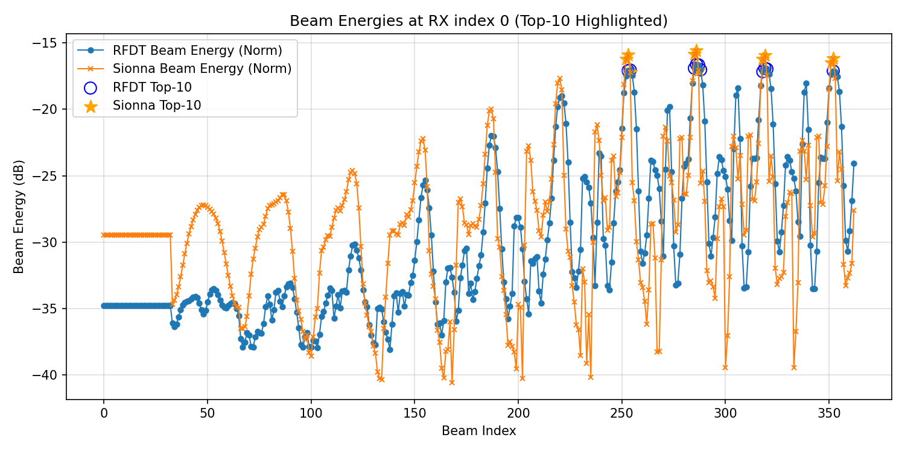
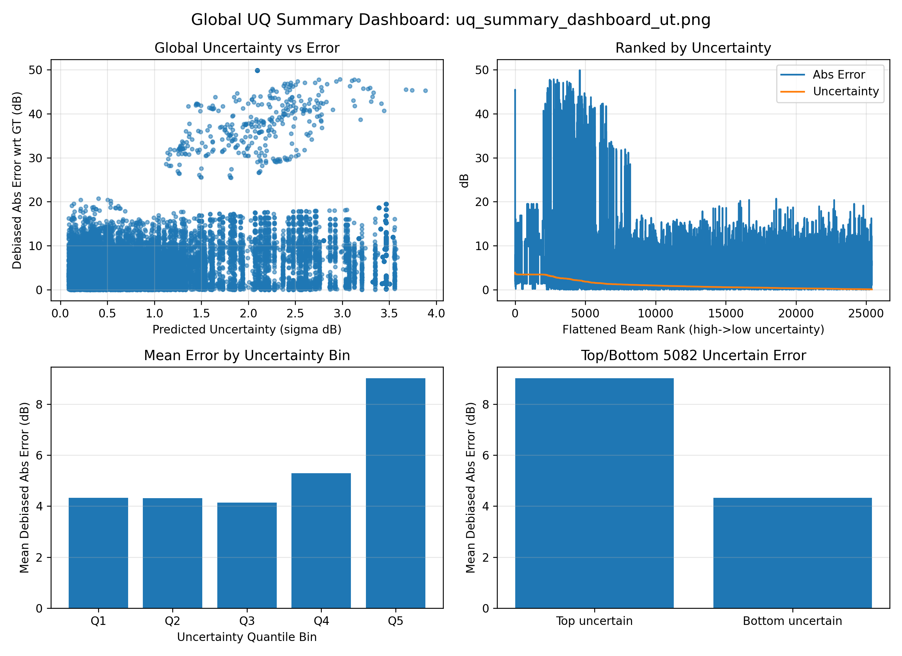
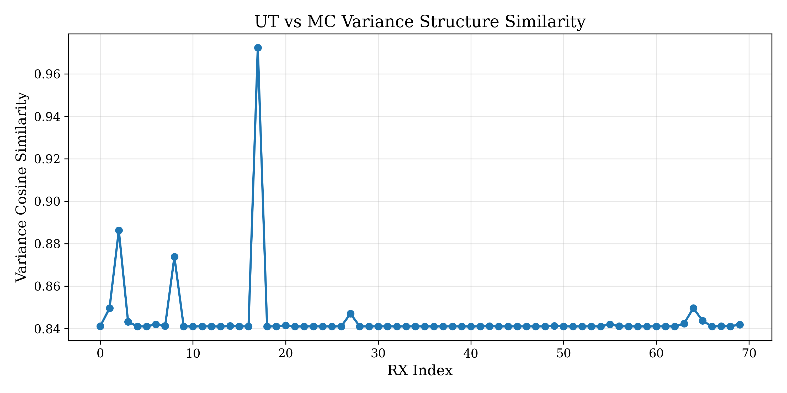

# Low-Rank Nonlinear Beamspace Uncertainty Propagation for RF Digital Twins

This repository provides a reproducible pipeline for beamspace uncertainty propagation in RF Digital Twins. It renders beamspace power from RF-3DGS point clouds, aligns with Sionna ray tracing, and propagates uncertainty using low-rank perturbations, Unscented Transform (UT), and Monte Carlo (MC) validation.

Important prerequisite: the `point_cloud.ply` input is produced by the RF-3DGS project.

- RF-3DGS code: https://github.com/SunLab-UGA/RF-3DGS
- RF-3DGS paper (arXiv): https://arxiv.org/abs/2411.19420
- IEEE TWC page: https://ieeexplore.ieee.org/document/11355734

## At a Glance

- Render RFDT beamspace power and gradients from RF-3DGS PLYs.
- Align RFDT outputs with Sionna ray tracing.
- Propagate uncertainty with UT and validate via MC.
- Produce reliability metrics and risk-aware beam selection.

## Repository Layout

```
.
├── scripts/                       # Pipeline entry points
│   ├── run_rfdt_rendering.py
│   ├── run_alignment_evaluation.py
│   ├── run_ut_propagation.py
│   ├── run_variance_validation.py
│   ├── plot_rfdt_vs_sionna_comparison.py
│   └── run_smoke_tests.py
├── scripts/preprocessing/         # Optional RF-3DGS data generation
├── scenes/                        # Sionna scene XMLs (expects scenes/meshes_d)
├── figures/                       # Reference figures
├── requirements.txt               # Python dependencies
├── uq_config.py                   # Config schema + helpers
├── uq_config.example.json         # Example config (copy to uq_config.json)
├── installation_usage.md          # Full setup and usage guide
└── README.md
```

## Quick Start (Run From Repo Root)

1. Create a config file and set paths:

   ```bash
   cp uq_config.example.json uq_config.json
   # Edit uq_config.json to set forward.ply_path and sionna.scene_xml
   ```

2. Run the pipeline:

   ```bash
   python scripts/run_rfdt_rendering.py --config uq_config.json --output-dir outputs
   python scripts/run_alignment_evaluation.py --config uq_config.json --rfdt outputs/rfdt_beam_energy_grid.npy --output outputs/sionna_beam_energy_grid_aligned.npy
   python scripts/run_ut_propagation.py --config uq_config.json --gt outputs/sionna_beam_energy_grid_aligned.npy --output-dir outputs
   python scripts/run_variance_validation.py --config uq_config.json --out-dir outputs/ut_mc_geometry_results
   python scripts/plot_rfdt_vs_sionna_comparison.py --config uq_config.json --rfdt outputs/rfdt_beam_energy_grid.npy --sionna outputs/sionna_beam_energy_grid_aligned.npy --save-dir outputs/plots
   ```

3. Optional smoke test:

   ```bash
   python scripts/run_smoke_tests.py --config uq_config.json --output-dir outputs --check-outputs
   ```

If you run from `scripts/`, pass a config path relative to that directory (for example `--config ../uq_config.json`).

## Configuration Essentials

- `forward.ply_path` must point to the RF-3DGS `point_cloud.ply`.
- `sionna.scene_xml` must match the scene used during RF-3DGS training.
- Relative paths are resolved against the config file location.
- You may override the PLY path via `--ply-path` on `run_rfdt_rendering.py`.

For full setup details, see [installation_usage.md](installation_usage.md).

## Outputs (Key Files)

- `rfdt_beam_energy_grid.npy`: RFDT beam energy in dB for all RX positions.
- `rfdt_beam_gradient_grid.npy`: RFDT energy gradients (per-RX, per-beam).
- `sionna_beam_energy_grid_aligned.npy`: Sionna-aligned beam energy grid.
- `rfdt_uq_mu_lin.npy`, `rfdt_uq_sigma_best_lin.npy`: UT mean and uncertainty (linear).
- `rfdt_selected_beams_topk.npy`: risk-aware beam selection.
- `uq_results.npz`: full UT and MC tensors for downstream analysis.

## Figures







## Tested Environment (Reference)

- Conda env: `rf-3dgs`
- Python: 3.10.19
- Sionna: 0.19.2 (RF-3DGS upstream notes 0.19.1 compatibility)
- TensorFlow: 2.15.1
- PyTorch: 2.10.0.dev20251212+cu130
- NumPy: 1.26.4

## Citation

Please cite RF-3DGS if you use the PLY generation pipeline or any RF-3DGS outputs:

```bibtex
@article{rf3dgs2024,
  title={RF-3DGS: Wireless Channel Modeling with Radio Radiance Field and 3D Gaussian Splatting},
  author={Lihao Zhang and Haijian Sun and Samuel Berweger and Camillo Gentile and Rose Qingyang Hu},
  journal={arXiv preprint arXiv:2411.19420},
  year={2024}
}
```

For the accepted IEEE TWC version, see: https://ieeexplore.ieee.org/document/11355734

## License

MIT License (see `LICENSE`).
