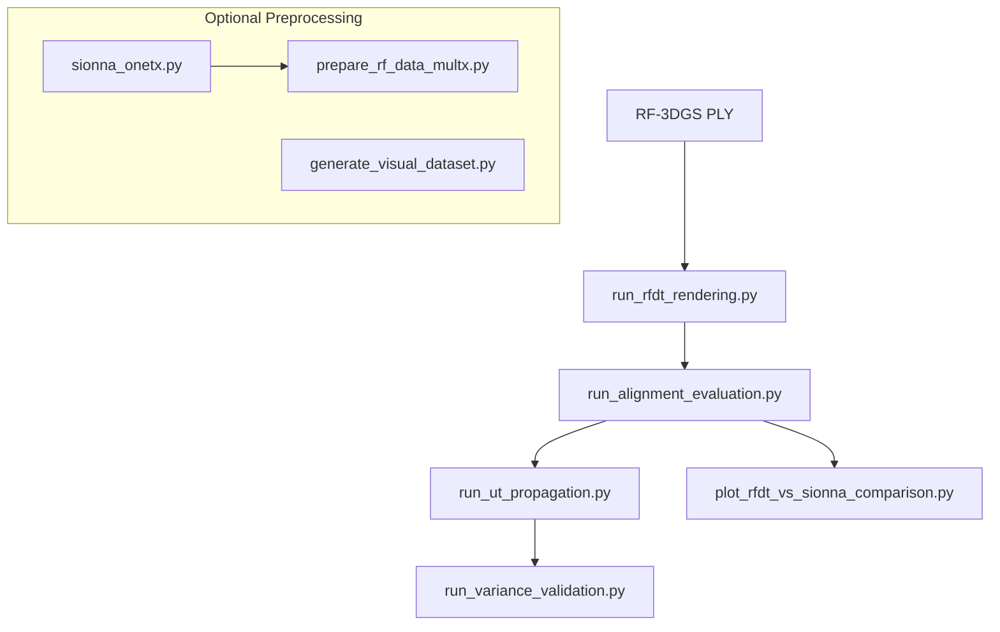

# Script and Function Reference

This document explains what each script does, what inputs it expects, what outputs it produces, and how key functions fit into the pipeline. Use it as a navigation map for the repo.

## Conventions and Pipeline Map
- All scripts resolve relative paths against the config file location via `uq_config.resolve_path`.
- `forward.*` config controls the RFDT forward model; `sionna.*` controls ray tracing; `uq.*` controls uncertainty.
- Beam energy tensors are typically shaped `[N_RX, N_BEAMS]`.
- Gradient tensors are typically shaped `[N_RX, N_BEAMS, 3]` (gradient wrt RX position).

## Core Pipeline Scripts

### scripts/run_rfdt_rendering.py
Role: Loads the RF-3DGS PLY, builds a beam codebook, and computes RFDT beam energy and gradients over the RX grid.

Inputs:
- `forward.ply_path`: RF-3DGS PLY with `x/y/z`, `opacity`, `f_dc_*`, `f_rest_*`, `scale_*`, `rot_*` fields.
- `forward.freq_hz`, `forward.tx_pos_m`, `forward.rx_grid`, and `forward.array` config.
- CLI overrides: `--ply-path`, `--device`.

Outputs:
- `rfdt_beam_energy_grid.npy`: RFDT beam energy in dB, shape `[N_RX, N_BEAMS]`.
- `rfdt_beam_gradient_grid.npy`: beam energy gradients, shape `[N_RX, N_BEAMS, 3]`.

Key behavior:
- Builds RX grid and array codebook once, then chunks Gaussians for memory safety.
- Converts RF-3DGS SH coefficients into a scalar channel power via a norm.
- Uses RF-3DGS opacity logits and converts to physical alpha with sigmoid.

Functions:
- `build_rx_grid`: Builds RX positions from config ranges.
- `build_dirs`: Creates the azimuth/elevation direction grid for beams.
- `build_codebook`: Builds steering vectors and beam gain lookup.
- `configure_from_config`: Loads `forward` config into module globals.
- `ensure_configured`: Prevents execution before config load.
- `load_scene`: Reads the PLY and assembles Gaussian parameters.
- `sh_radiance`: Evaluates SH radiance per direction.
- `build_inverse_covariance`: Creates inverse covariance matrices from scale + quaternion.
- `gaussian_kernel_and_grad`: Kernel and gradient for a Gaussian evaluated at RX.
- `compute_kernel`: Attenuated kernel for the forward model (chunked).
- `compute_beam_energy_and_grad`: Main forward + gradient computation.
- `parse_args`, `main`: CLI and execution.

Notes:
- Use `forward.gaussian_chunk` to balance memory vs throughput.
- CPU mode (`--device cpu`) is useful for debugging but slower.

### scripts/run_alignment_evaluation.py
Role: Runs Sionna ray tracing, aligns Sionna beam energies to RFDT, reports agreement metrics, and saves aligned Sionna grids.

Inputs:
- `sionna.scene_xml` and `sionna.*` ray tracing parameters.
- `forward.*` for RX grid and array geometry.
- RFDT energy file via `--rfdt` (default `rfdt_beam_energy_grid.npy`).

Outputs:
- `sionna_beam_energy_grid_aligned.npy`: Sionna beam energies aligned to RFDT.
- Console metrics: cosine, Spearman, Pearson, MAE, top-k overlap, angle error.

Key behavior:
- Computes Sionna paths for each RX, accumulates beam power with a soft angular window.
- Aligns Sionna and RFDT by rotating the beam grid to match dominant directions.

Functions:
- `build_rx_grid`, `build_dirs`, `build_codebook`: Same role as RFDT forward.
- `build_materials`: Builds Sionna `RadioMaterial` definitions from config.
- `apply_materials`: Applies keyword-based material remapping.
- `compute_sionna_beam_energy`: Accumulates beam power from Sionna paths.
- `normalize_db`, `dominant_dir`, `rodrigues`: Alignment helpers.
- `parse_args`, `main`: CLI and orchestration.

### scripts/run_ut_propagation.py
Role: Runs UT-based UQ propagation, validates against MC, saves diagnostics, and produces risk-aware beam selection outputs.

Inputs:
- `forward.ply_path`: RF-3DGS PLY used by the forward model.
- `uq.*` for uncertainty priors and UT settings.
- Optional Sionna GT via `--gt` for validation metrics.

Outputs (primary):
- `rfdt_uq_mu_lin.npy`: UT mean in linear power, shape `[N_RX, N_BEAMS]`.
- `rfdt_uq_sigma_best_lin.npy`: UT sigma in linear power.
- `uq_results.npz`: full UT sigma-point tensors, MC samples, metadata.

Outputs (diagnostics):
- `uq_summary_dashboard_*.png`, `uq_overlap_*.{txt,json}`, `uq_beam_summary_*.csv`.
- `rfdt_selected_beams_topk.npy`, `rfdt_beam_score_riskaware.npy`.

Key behavior:
- UT state vector includes RX perturbation, per-mode Gaussian parameter perturbations, and directional/smoothing terms.
- MC is used for validation only; UT is the deployable model.
- Risk-aware beam selection uses `score = mu_db - lambda * sigma_db`.

Classes:
- `UQConfig`: Dataclass for UQ hyperparameters, with `apply_dict` for config merge.

Functions:
- `_make_modes`, `_build_theta_and_cov`, `_unpack_theta`: UT state construction.
- `build_sigma_points`: Standard UT sigma points + weights.
- `_forward_from_theta`: Runs perturbed forward passes.
- `ut_propagation`, `mc_propagation`: UT/MC inference.
- `validate_ut_vs_mc`, `validate_uncertainty_against_gt`: Metrics.
- `save_dashboard`, `save_beam_summary_table`, `save_overlap_evidence_quantile`: Reports.
- `parse_args`, `main`: CLI and orchestration.

### scripts/run_variance_validation.py
Role: Compares UT vs MC marginal variance geometry and saves summary plots.

Inputs:
- UT outputs (`rfdt_uq_mu_lin.npy`, `rfdt_uq_sigma_best_lin.npy`).
- MC samples from `uq_results.npz`.

Outputs:
- Plots in `ut_mc_geometry_results/` (cosine similarity, Pearson correlation, top-k energy).
- Summary files `summary.npy` and `summary.txt`.

Functions:
- `load_inputs`, `compute_mc_variances`, `compute_metrics`: Metric computation.
- `plot_variance_cosine`, `plot_variance_pearson`, `plot_topk_energy`, `plot_topk_gap`.
- `parse_args`, `main`: CLI and execution.

### scripts/plot_rfdt_vs_sionna_comparison.py
Role: Plots RFDT vs aligned Sionna beam energies with top-k highlights.

Inputs:
- RFDT energy grid (`--rfdt`) and aligned Sionna grid (`--sionna`).
- RX selection via `--rx-indices` or `--rx-count`.

Outputs:
- PNG plots saved under `--save-dir` or shown interactively.

Functions:
- `normalize_db`: Per-RX normalization (optional).
- `select_rx_indices`: Picks RXs by list or uniform spacing.
- `plot_rx`: Generates one comparison plot.
- `parse_args`, `main`: CLI and execution.

### scripts/run_smoke_tests.py
Role: Basic validation of config paths, dependency imports, and expected outputs.

Inputs:
- `--config` and `--output-dir`.

Outputs:
- Console checks; raises if any required item is missing.

Functions:
- `check_path`, `check_import`: Single-purpose validation helpers.
- `parse_args`, `main`.

## Preprocessing Scripts

### scripts/preprocessing/generate_visual_dataset.py
Role: Uses Blender to generate a visual dataset (images + transforms) for RF-3DGS training.

Inputs:
- `preprocess.visual.*` config or CLI overrides.
- Meshes directory (typically `meshes_d`).

Outputs:
- `images/` rendered frames.
- `transforms_train.json` and `transforms_test.json`.

Key behavior:
- Multiple camera sampling strategies (perimeter, detail, top-down, focus orbits).
- Material assignment by filename keywords for texture diversity.

Functions:
- `load_visual_config`, `configure_from_config`: Merge and apply config values.
- `setup_render_engine`, `setup_lighting`, `import_models`: Scene preparation.
- `generate_focus_orbit`, `render_frame`: Rendering helpers.
- `main`: Orchestrates the full dataset generation pipeline.

### scripts/preprocessing/prepare_rf_data_multx.py
Role: Repackages multi-TX spectrum outputs into an RF-3DGS dataset layout with train/test splits.

Inputs:
- `preprocess.rf_multitx.*` config or CLI overrides.
- `spectrum_tx*/` folders containing images.

Outputs:
- `images/` (renamed) and `sparse/0/` COLMAP files.
- `train_index.txt` and `test_index.txt`.

Functions:
- `load_multitx_config`: Applies config and resolves paths.
- `main`: Creates folders, copies images, and writes indices.

### scripts/preprocessing/sionna_onetx.py
Role: Generates RF-3DGS training datasets from Sionna ray tracing.

Modes:
- `--ideal`: MPC/AoD/Delay/Phase spectrum datasets.
- `--mvdr` or `--cbf`: Beamforming datasets with UPA arrays.

Outputs:
- `spectrum/` images, `cameras.txt`, `images.txt` in output dir.
- Optional `phase_norm_stats.txt` for phase normalization.

Key behavior:
- Converts equirectangular spectra to perspective views.
- Normalizes dataset-wide spectrum stats for stable visualization.
- MVDR/CBF uses array manifold vectors and time-domain responses.

Classes:
- `Camera`, `colmap_Image`: Minimal COLMAP structures.
- `Equirectangular`: Helper for equirectangular-to-perspective projection.

Functions:
- `build_rx_locs`, `apply_materials`: Scene setup helpers.
- `plot_spatial_spectrum`, `plot_aod_spatial_spectrum`, `plot_delay_spatial_spectrum`, `plot_phase_spectrum`.
- `MVDR_spectrum`, `CBF_spectrum`, `generate_mvdr_dataset`.
- `generate_ideal_dataset`: Builds ideal spectrum datasets.
